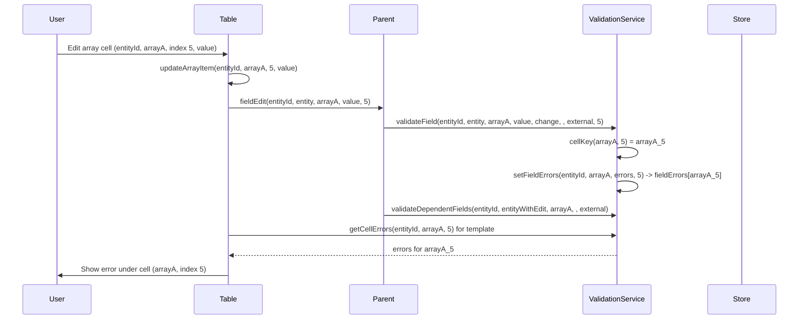

# Kế hoạch: Validate và set error cho từng cell

## Hiện trạng

- Lỗi được lưu theo **entityId + field**: `ValidationState.fieldErrors` key = tên field (string). Một field array (vd. `arrayA`) chỉ có một key `"arrayA"` → không phân biệt từng ô.
- [ValidationService](src/app/core/services/validation.service.ts) chỉ có `setFieldErrors(entityId, field, errors)`, `getFieldErrors(entityId, field)` — không có tham số `arrayIndex`.
- [generic-table](src/app/components/generic-table/generic-table.component.ts): `fieldEdit` chỉ emit khi edit **base field**; edit array cell không emit, nên parent không thể validate từng ô.
- Template table hiện không hiển thị lỗi validation (chưa có binding tới ValidationService).

## Hướng thiết kế

- **Cell key**: với field thường = 1 ô → key = `field`; với field array → key = `field_arrayIndex` (vd. `arrayA_5`). Lưu/đọc lỗi theo key này.
- **Backward compatible**: `getFieldErrors(entityId, field)` không truyền `arrayIndex` → với field thường trả về lỗi ô đó; với field array có thể quy ước trả về lỗi ô đầu hoặc gom tất cả lỗi của field (tùy chọn; đề xuất: chỉ hỗ trợ get theo cell khi có `arrayIndex` cho array field).
- **Validate**: khi validate một ô array, gọi `validateField(entityId, entity, arrayField, value, trigger, ..., arrayIndex)` với `value = array[arrayIndex]`; context có `arrayIndex` để validator dùng.

---

## 1. Models – [validation.models.ts](src/app/core/models/validation.models.ts)

- **ValidationError**: thêm optional `arrayIndex?: number` (để UI/format biết lỗi thuộc ô nào).
- **ValidationContext**: thêm optional `arrayIndex?: number` (đã có `rowIndex`; dùng `arrayIndex` cho chỉ số phần tử trong array).
- **ValidationState**: giữ `fieldErrors: Record<string, ValidationError[]>`; key sẽ là cell key (`field` hoặc `field_index`). Không đổi interface.

---

## 2. ValidationService – [validation.service.ts](src/app/core/services/validation.service.ts)

- **Helper nội bộ**: `cellKey(field: string, arrayIndex?: number): string` → `arrayIndex === undefined ? field :` ${field}_${arrayIndex}``.
- **validateField**: thêm tham số optional `arrayIndex?: number`. Build `ValidationContext` với `arrayIndex`; gọi xong validator thì `setFieldErrors(entityId, field, errors, arrayIndex)`.
- **setFieldErrors**: thêm optional `arrayIndex?: number`; key = `cellKey(field, arrayIndex)`.
- **getFieldErrors(entityId, field, arrayIndex?)**: key = `cellKey(field, arrayIndex)`, trả về `state.fieldErrors[key] || []`.
- **getCellErrors(entityId, field, arrayIndex?)**: public API, gọi `getFieldErrors(entityId, field, arrayIndex)` (alias hoặc trùng logic).
- **clearFieldValidation(entityId, field, arrayIndex?)**:  
  - Nếu `arrayIndex === undefined`: xóa key `field` và mọi key dạng `field_*` (cho array).  
  - Nếu có `arrayIndex`: chỉ xóa `field_${arrayIndex}`.
- **isFieldValid(entityId, field, arrayIndex?)**: dùng `cellKey(field, arrayIndex)`, kiểm tra không có error severity trong mảng lỗi đó.
- **Async validation**: payload hiện tại `{ entityId, field, validator, context }` — đảm bảo `context` có `arrayIndex` khi validate ô array; trong subscriber gọi `setFieldErrors(entityId, field, result.errors, context.arrayIndex)` (cần truyền arrayIndex từ nơi gọi vào context).
- **validateEntity** (khi submit): với mỗi field trong config, lấy `value = entity[field]`. Nếu `Array.isArray(value)`, gọi `validateField(entityId, entity, field, value[i], trigger, allEntities, external, i)` cho từng `i`; nếu không phải array, gọi `validateField(..., value, ..., undefined)` như hiện tại. Như vậy submit sẽ validate từng ô của field array.

---

## 3. Generic table – [generic-table.component.ts](src/app/components/generic-table/generic-table.component.ts) và template

- **fieldEdit payload**: mở rộng thành `{ entityId, entity, field, value, arrayIndex?: number }`. Khi edit **array cell** (branch `col.type === 'array' && col.arrayField && col.arrayIndex !== undefined`), sau `editBuffer.updateArrayItem(...)` cũng emit `fieldEdit` với `field = col.arrayField`, `value` (giá trị ô), `arrayIndex = col.arrayIndex`.
- **Input (optional)**: `@Input() validationService?: ValidationService<TEntity>`. Nếu có, table dùng để hiển thị lỗi theo ô.
- **Template**: với mỗi cell có thể edit, thêm block hiển thị lỗi (vd. `mat-error` hoặc `span.cell-error`) khi `validationService && getCellErrors(row.entityId, cellField, col.arrayIndex).length > 0`, với `cellField = col.type === 'array' ? col.arrayField : col.field`. Cần method trên component: `getCellErrors(entityId, field, arrayIndex?)` gọi `this.validationService?.getCellErrors(entityId, field, arrayIndex) ?? []` (và có thể cache/subscribe nếu ValidationService trả Observable; hiện tại getCellErrors có thể trả mảng đồng bộ từ state). Có thể thêm class cho ô/cell khi có lỗi (vd. `class.cell-error`) để style.
- **Chú ý**: Table không provide ValidationService; parent (order-table-with-external) provide và truyền xuống qua `[validationService]="validationService"` (parent cần expose qua property nếu đang dùng constructor inject).

---

## 4. Parent – [order-table-with-external.component.ts](src/app/features/orders/order-table-with-external.component.ts)

- **onFieldEdit**: signature thêm `arrayIndex?: number`. Gọi `validationService.validateField(entityId, entity, field, value, 'change', undefined, external, arrayIndex)`. Khi gọi `validateDependentFields`, tạo `entityWithEdit`: nếu `arrayIndex !== undefined` thì clone entity và gán `entity[field][arrayIndex] = value` (clone mảng rồi gán); nếu không thì `entity[field] = value`. Truyền `entityWithEdit` vào `validateDependentFields`.
- **Template**: bind `(fieldEdit)="onFieldEdit($event.entityId, $event.entity, $event.field, $event.value, $event.arrayIndex)"` và nếu dùng hiển thị lỗi ở table thì truyền `[validationService]="validationService"` (với property tương ứng trên component).

---

## 5. Validation config và validators – [order.validation.external.ts](src/app/features/orders/order.validation.external.ts) / validators.library

- Config hiện tại theo **field** (vd. `arrayA`) là đủ: khi validate ô, service gọi `validateField(..., 'arrayA', value, ..., arrayIndex)` với `value = arrayA[i]`. Validator nhận `context.arrayIndex` và `context.value` (một phần tử). Không bắt buộc đổi config; validator nào cần biết “ô thứ mấy” thì dùng `context.arrayIndex` (và có thể ghi vào `error.arrayIndex` khi tạo ValidationError nếu cần).
- **ValidationError** khi tạo từ validator: có thể set `arrayIndex: context.arrayIndex` để đồng bộ với model.

---

## 6. Luồng dữ liệu (tóm tắt)

---

## 7. Set error thủ công cho một cell

- Sau khi có `setFieldErrors(entityId, field, errors, arrayIndex?)`, parent hoặc service khác có thể gọi trực tiếp để set lỗi cho một ô: `validationService.setFieldErrors(entityId, 'arrayA', [{ message: '...', code: '...', severity: 'error', field: 'arrayA', arrayIndex: 5 }], 5)`. Cần expose `setFieldErrors` (hoặc `setCellErrors`) ra public nếu hiện tại đang private; plan đề xuất giữ `setFieldErrors` internal và thêm public `setCellErrors(entityId, field, errors, arrayIndex?)` gọi internal setFieldErrors.

---

## 8. Các file cần sửa (checklist)

| File                                                                                                     | Thay đổi                                                                                                                                                                                                                 |
| -------------------------------------------------------------------------------------------------------- | ------------------------------------------------------------------------------------------------------------------------------------------------------------------------------------------------------------------------ |
| [validation.models.ts](src/app/core/models/validation.models.ts)                                         | ValidationError: `arrayIndex?`; ValidationContext: `arrayIndex?`.                                                                                                                                                        |
| [validation.service.ts](src/app/core/services/validation.service.ts)                                     | cellKey; validateField/setFieldErrors/getFieldErrors/clearFieldValidation/isFieldValid thêm arrayIndex; getCellErrors; validateEntity loop array indices; async flow truyền arrayIndex; (optional) setCellErrors public. |
| [generic-table.component.ts](src/app/components/generic-table/generic-table.component.ts)                | fieldEdit payload + emit cho array cell; @Input validationService; getCellErrors().                                                                                                                                      |
| [generic-table.component.html](src/app/components/generic-table/generic-table.component.html)            | Hiển thị lỗi theo cell khi validationService và getCellErrors(...).length > 0.                                                                                                                                           |
| [order-table-with-external.component.ts](src/app/features/orders/order-table-with-external.component.ts) | onFieldEdit(entityId, entity, field, value, arrayIndex?); entityWithEdit cho array; (optional) [validationService] và property.                                                                                          |

---

## 9. Rủi ro / lưu ý

- **Performance**: Với nhiều ô (vd. 48 cột array), mỗi ô một key trong `fieldErrors` → số key tăng nhưng vẫn O(1) lookup. Clear “cả field” array cần duyệt key `field_*` (O(số ô đã validate của field đó)).
- **getFieldErrors(entityId, field)** không truyền arrayIndex với field array: có thể quy ước trả về `[]` hoặc gom tất cả lỗi có key `field` và `field_*`; document rõ trong code hoặc JSDoc.
- **Mat-table**: getCellErrors gọi nhiều lần mỗi row/column; nếu sau này ValidationService trả Observable theo cell, cần subscribe/async pipe và tránh subscribe quá nhiều (có thể dùng một Observable “all states” và map trong template).

